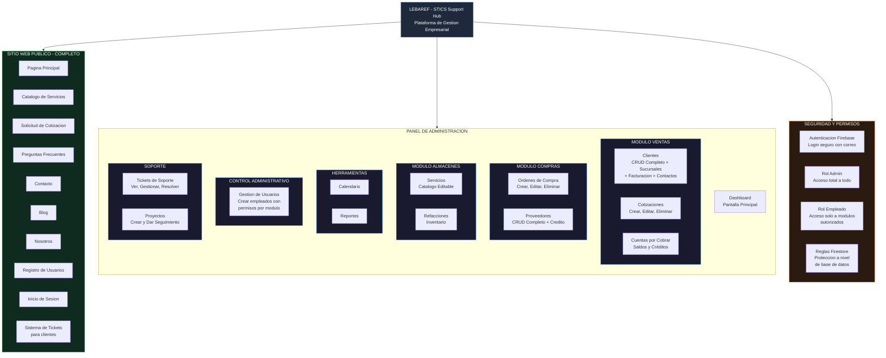
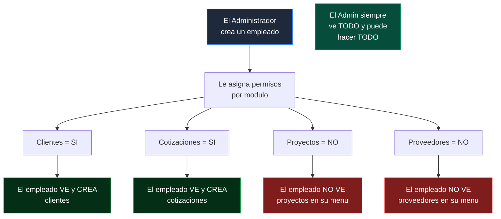
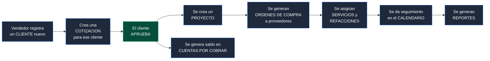
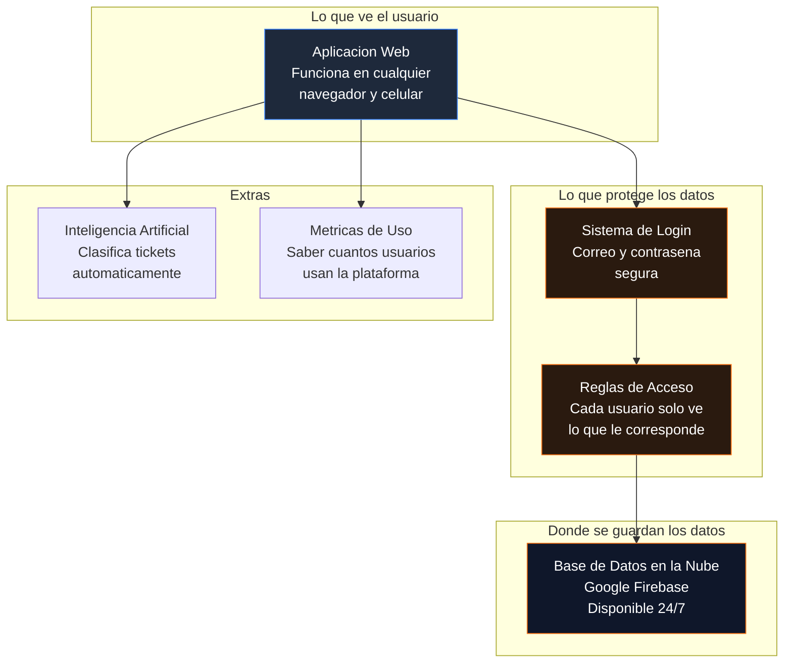

# Lebaref - STICS Support Hub
# Resumen Ejecutivo del Proyecto

---

## Estado General de la Plataforma

---

## Estado de Avance por Modulo

```mermaid
graph LR
    subgraph LISTO ["TERMINADO Y FUNCIONAL"]
        direction TB
        OK1["Sitio Web Publico\nTodas las paginas"]
        OK2["Login y Registro\nAutenticacion"]
        OK3["Dashboard Admin\nPantalla principal"]
        OK4["Clientes\nFormulario completo con\n4 secciones y sucursales"]
        OK5["Proveedores\nCRUD con credito"]
        OK6["Cotizaciones\nCRUD con partidas"]
        OK7["Ordenes de Compra\nCRUD con partidas"]
        OK8["Servicios\nCatalogo editable"]
        OK9["Refacciones\nInventario"]
        OK10["Tickets de Soporte\nCrear y gestionar"]
        OK11["Proyectos\nCrear y dar seguimiento"]
        OK12["Control de Usuarios\nCrear con permisos"]
        OK13["Permisos por Modulo\nAdmin vs Empleado"]
        OK14["Reglas de Seguridad\nFirestore Rules"]
        OK15["Cuentas por Cobrar\nSaldos y Abonos"]
    end

    subgraph PENDIENTE ["PENDIENTE DE VALIDAR"]
        direction TB
        P1["Calendario\nInterfaz existe,\nfalta conectar datos"]
        P2["Reportes\nInterfaz existe,\nfalta conectar datos"]
        P3["Notificaciones por correo\nAlertas de clientes\ninactivos al vendedor"]
        P4["Documentos fiscales\nadjuntos en Clientes\nRequiere Firebase Storage"]
        P5["IA - Priorizacion\nde Tickets automatica\nRequiere API Key de Gemini"]
    end

    style LISTO fill:#052e16,stroke:#22c55e,color:#fff
    style PENDIENTE fill:#451a03,stroke:#f59e0b,color:#fff
```

---

## Como Funciona el Sistema de Permisos

---

## Flujo de Trabajo Tipico

---

## Tecnologia Utilizada (Resumen No Tecnico)

