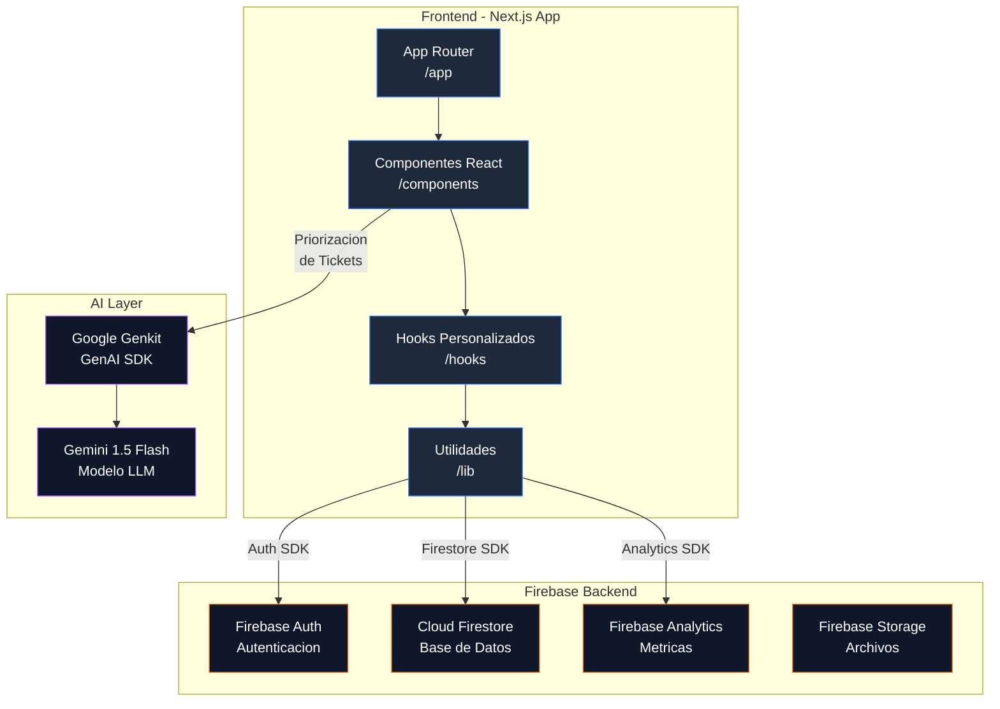

# Arquitectura General del Sistema

```mermaid
graph TB
    subgraph "Frontend - Next.js App"
        A["App Router\n/app"]
        B["Componentes React\n/components"]
        C["Hooks Personalizados\n/hooks"]
        D["Utilidades\n/lib"]
    end

    subgraph "Firebase Backend"
        E["Firebase Auth\nAutenticacion"]
        F["Cloud Firestore\nBase de Datos"]
        G["Firebase Analytics\nMetricas"]
        H["Firebase Storage\nArchivos"]
    end

    subgraph "AI Layer"
        I["Google Genkit\nGenAI SDK"]
        J["Gemini 1.5 Flash\nModelo LLM"]
    end

    A --> B
    B --> C
    C --> D
    D -->|"Auth SDK"| E
    D -->|"Firestore SDK"| F
    D -->|"Analytics SDK"| G 
    I --> J
    B -->|"Priorizacion\nde Tickets"| I

    style A fill:#1e293b,stroke:#3b82f6,color:#fff
    style B fill:#1e293b,stroke:#3b82f6,color:#fff
    style C fill:#1e293b,stroke:#3b82f6,color:#fff
    style D fill:#1e293b,stroke:#3b82f6,color:#fff
    style E fill:#0f172a,stroke:#f97316,color:#fff
    style F fill:#0f172a,stroke:#f97316,color:#fff
    style G fill:#0f172a,stroke:#f97316,color:#fff
    style H fill:#0f172a,stroke:#f97316,color:#fff
    style I fill:#0f172a,stroke:#a855f7,color:#fff
    style J fill:#0f172a,stroke:#a855f7,color:#fff
```
