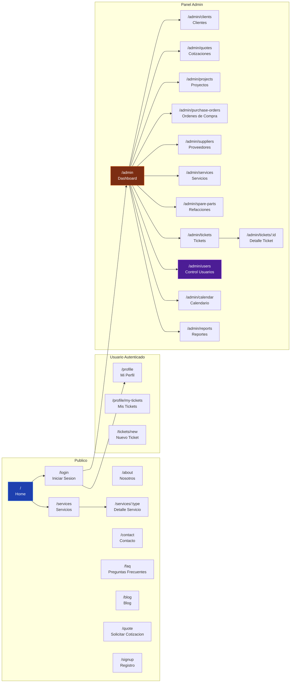

# Mapa de Rutas y Navegacion

```mermaid
graph LR
    subgraph "Publico"
        HOME["/\nHome"]
        ABOUT["/about\nNosotros"]
        SERVICES["/services\nServicios"]
        SVC_TYPE["/services/:type\nDetalle Servicio"]
        CONTACT["/contact\nContacto"]
        FAQ["/faq\nPreguntas Frecuentes"]
        BLOG["/blog\nBlog"]
        QUOTE["/quote\nSolicitar Cotizacion"]
        LOGIN["/login\nIniciar Sesion"]
        SIGNUP["/signup\nRegistro"]
    end

    subgraph "Usuario Autenticado"
        PROFILE["/profile\nMi Perfil"]
        MY_TICKETS["/profile/my-tickets\nMis Tickets"]
        NEW_TICKET["/tickets/new\nNuevo Ticket"]
    end

    subgraph "Panel Admin"
        DASH["/admin\nDashboard"]
        ADM_CLIENTS["/admin/clients\nClientes"]
        ADM_QUOTES["/admin/quotes\nCotizaciones"]
        ADM_PROJECTS["/admin/projects\nProyectos"]
        ADM_PO["/admin/purchase-orders\nOrdenes de Compra"]
        ADM_SUPPLIERS["/admin/suppliers\nProveedores"]
        ADM_SERVICES["/admin/services\nServicios"]
        ADM_PARTS["/admin/spare-parts\nRefacciones"]
        ADM_TICKETS["/admin/tickets\nTickets"]
        ADM_TICKET_D["/admin/tickets/:id\nDetalle Ticket"]
        ADM_USERS["/admin/users\nControl Usuarios"]
        ADM_CALENDAR["/admin/calendar\nCalendario"]
        ADM_REPORTS["/admin/reports\nReportes"]
    end

    HOME --> LOGIN
    HOME --> SERVICES
    LOGIN --> DASH
    LOGIN --> PROFILE
    DASH --> ADM_CLIENTS
    DASH --> ADM_QUOTES
    DASH --> ADM_PROJECTS
    DASH --> ADM_PO
    DASH --> ADM_SUPPLIERS
    DASH --> ADM_SERVICES
    DASH --> ADM_PARTS
    DASH --> ADM_TICKETS
    DASH --> ADM_USERS
    DASH --> ADM_CALENDAR
    DASH --> ADM_REPORTS
    ADM_TICKETS --> ADM_TICKET_D
    SERVICES --> SVC_TYPE

    style HOME fill:#1e40af,stroke:#60a5fa,color:#fff
    style DASH fill:#7c2d12,stroke:#f97316,color:#fff
    style ADM_USERS fill:#4c1d95,stroke:#a855f7,color:#fff
```
