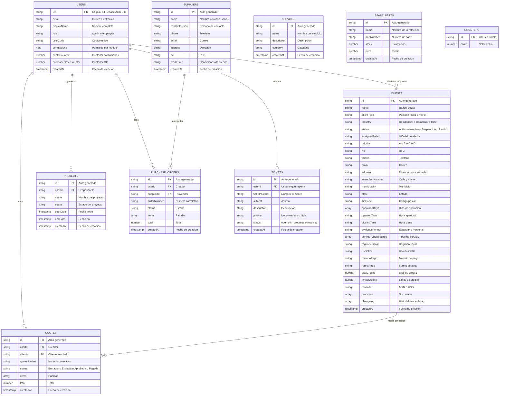

# Modelo de Datos - Firestore ERD

```mermaid
erDiagram
    USERS {
        string uid PK "ID igual a Firebase Auth UID"
        string email "Correo electronico"
        string displayName "Nombre completo"
        string role "admin o employee"
        string userCode "Codigo unico"
        map permissions "Permisos por modulo"
        number quoteCounter "Contador cotizaciones"
        number purchaseOrderCounter "Contador OC"
        timestamp createdAt "Fecha de creacion"
    }

    CLIENTS {
        string id PK "Auto-generado"
        string name "Razon Social"
        string clientType "Persona fisica o moral"
        string industry "Residencial o Comercial o Hotel"
        string status "Activo o Inactivo o Suspendido o Perdido"
        string assignedSeller "UID del vendedor"
        string priority "A o B o C o D"
        string rfc "RFC"
        string phone "Telefono"
        string email "Correo"
        string address "Direccion concatenada"
        string streetAndNumber "Calle y numero"
        string municipality "Municipio"
        string state "Estado"
        string zipCode "Codigo postal"
        array operationDays "Dias de operacion"
        string openingTime "Hora apertura"
        string closingTime "Hora cierre"
        string evidenceFormat "Estandar o Personal"
        array serviceTypeRequired "Tipos de servicio"
        string regimenFiscal "Regimen fiscal"
        string usoCFDI "Uso de CFDI"
        string metodoPago "Metodo de pago"
        string formaPago "Forma de pago"
        number diasCredito "Dias de credito"
        number limiteCredito "Limite de credito"
        string moneda "MXN o USD"
        array branches "Sucursales"
        array changelog "Historial de cambios"
        timestamp createdAt "Fecha de creacion"
    }

    QUOTES {
        string id PK "Auto-generado"
        string userId FK "Creador"
        string clientId FK "Cliente asociado"
        string quoteNumber "Numero correlativo"
        string status "Borrador o Enviada o Aprobada o Pagada"
        array items "Partidas"
        number total "Total"
        timestamp createdAt "Fecha de creacion"
    }

    PROJECTS {
        string id PK "Auto-generado"
        string userId FK "Responsable"
        string name "Nombre del proyecto"
        string status "Estado del proyecto"
        timestamp startDate "Fecha inicio"
        timestamp endDate "Fecha fin"
        timestamp createdAt "Fecha de creacion"
    }

    PURCHASE_ORDERS {
        string id PK "Auto-generado"
        string userId FK "Creador"
        string supplierId FK "Proveedor"
        string orderNumber "Numero correlativo"
        string status "Estado"
        array items "Partidas"
        number total "Total"
        timestamp createdAt "Fecha de creacion"
    }

    SUPPLIERS {
        string id PK "Auto-generado"
        string name "Nombre o Razon Social"
        string contactPerson "Persona de contacto"
        string phone "Telefono"
        string email "Correo"
        string address "Direccion"
        string rfc "RFC"
        string creditTime "Condiciones de credito"
        timestamp createdAt "Fecha de creacion"
    }

    SERVICES {
        string id PK "Auto-generado"
        string name "Nombre del servicio"
        string description "Descripcion"
        string category "Categoria"
        timestamp createdAt "Fecha de creacion"
    }

    SPARE_PARTS {
        string id PK "Auto-generado"
        string name "Nombre de la refaccion"
        string partNumber "Numero de parte"
        number stock "Existencias"
        number price "Precio"
        timestamp createdAt "Fecha de creacion"
    }

    TICKETS {
        string id PK "Auto-generado"
        string userId FK "Usuario que reporta"
        string ticketNumber "Numero de ticket"
        string subject "Asunto"
        string description "Descripcion"
        string priority "low o medium o high"
        string status "open o in_progress o resolved"
        timestamp createdAt "Fecha de creacion"
    }

    COUNTERS {
        string id PK "users o tickets"
        number count "Valor actual"
    }

    USERS ||--o{ QUOTES : "crea"
    USERS ||--o{ PROJECTS : "gestiona"
    USERS ||--o{ PURCHASE_ORDERS : "crea"
    USERS ||--o{ TICKETS : "reporta"
    USERS ||--o{ CLIENTS : "vendedor asignado"
    CLIENTS ||--o{ QUOTES : "recibe cotizacion"
    SUPPLIERS ||--o{ PURCHASE_ORDERS : "surte orden"
```
