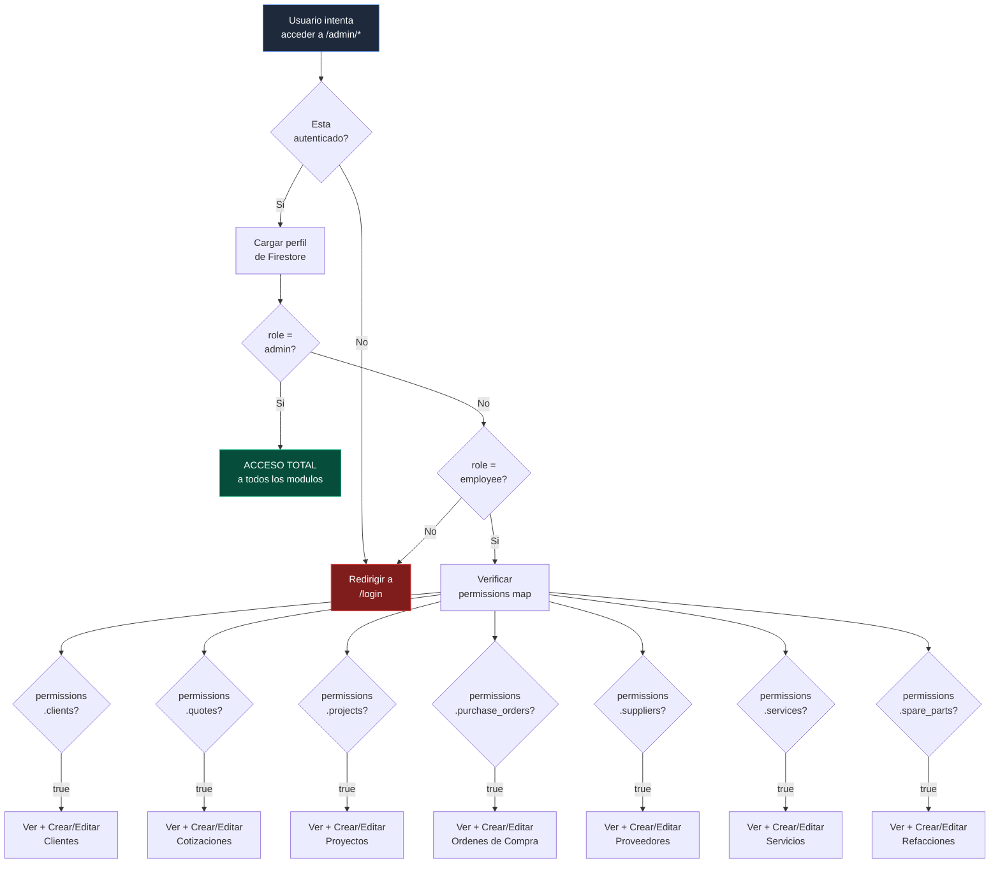

# Sistema de Autenticacion y Permisos

```mermaid
flowchart TD
    A["Usuario intenta\nacceder a /admin/*"] --> B{"Esta\nautenticado?"}
    B -->|No| C["Redirigir a\n/login"]
    B -->|Si| D["Cargar perfil\nde Firestore"]
    D --> E{"role =\nadmin?"}
    E -->|Si| F["ACCESO TOTAL\na todos los modulos"]
    E -->|No| G{"role =\nemployee?"}
    G -->|Si| H["Verificar\npermissions map"]
    G -->|No| C

    H --> I{"permissions\n.clients?"}
    H --> J{"permissions\n.quotes?"}
    H --> K{"permissions\n.projects?"}
    H --> L{"permissions\n.purchase_orders?"}
    H --> M{"permissions\n.suppliers?"}
    H --> N{"permissions\n.services?"}
    H --> O{"permissions\n.spare_parts?"}

    I -->|true| I1["Ver + Crear/Editar\nClientes"]
    J -->|true| J1["Ver + Crear/Editar\nCotizaciones"]
    K -->|true| K1["Ver + Crear/Editar\nProyectos"]
    L -->|true| L1["Ver + Crear/Editar\nOrdenes de Compra"]
    M -->|true| M1["Ver + Crear/Editar\nProveedores"]
    N -->|true| N1["Ver + Crear/Editar\nServicios"]
    O -->|true| O1["Ver + Crear/Editar\nRefacciones"]

    style A fill:#1e293b,stroke:#3b82f6,color:#fff
    style F fill:#064e3b,stroke:#10b981,color:#fff
    style C fill:#7f1d1d,stroke:#ef4444,color:#fff
```
