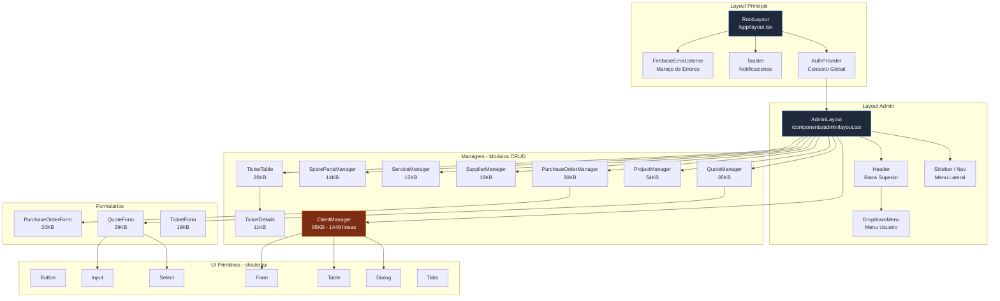

# Jerarquia de Componentes

```mermaid
graph TD
    subgraph "Layout Principal"
        ROOT["RootLayout\n/app/layout.tsx"]
        AUTH_P["AuthProvider\nContexto Global"]
        TOAST["Toaster\nNotificaciones"]
        FEL["FirebaseErrorListener\nManejo de Errores"]
    end

    subgraph "Layout Admin"
        ADM_LAYOUT["AdminLayout\n/components/admin/layout.tsx"]
        SIDEBAR["Sidebar / Nav\nMenu Lateral"]
        HEADER["Header\nBarra Superior"]
        DROPDOWN["DropdownMenu\nMenu Usuario"]
    end

    subgraph "Managers - Modulos CRUD"
        CM["ClientManager\n95KB - 1449 lineas"]
        QM["QuoteManager\n35KB"]
        PM["ProjectManager\n54KB"]
        POM["PurchaseOrderManager\n30KB"]
        SM["SupplierManager\n16KB"]
        SVM["ServiceManager\n15KB"]
        SPM["SparePartsManager\n14KB"]
        TT["TicketTable\n20KB"]
        TD_C["TicketDetails\n11KB"]
    end

    subgraph "Formularios"
        QF["QuoteForm\n29KB"]
        POF["PurchaseOrderForm\n20KB"]
        TF["TicketForm\n19KB"]
    end

    subgraph "UI Primitivos - shadcn/ui"
        BTN["Button"]
        INP["Input"]
        DLG["Dialog"]
        TBL["Table"]
        FORM["Form"]
        SEL["Select"]
        TABS["Tabs"]
    end

    ROOT --> AUTH_P
    ROOT --> TOAST
    ROOT --> FEL
    AUTH_P --> ADM_LAYOUT
    ADM_LAYOUT --> SIDEBAR
    ADM_LAYOUT --> HEADER
    HEADER --> DROPDOWN
    ADM_LAYOUT --> CM
    ADM_LAYOUT --> QM
    ADM_LAYOUT --> PM
    ADM_LAYOUT --> POM
    ADM_LAYOUT --> SM
    ADM_LAYOUT --> SVM
    ADM_LAYOUT --> SPM
    ADM_LAYOUT --> TT
    TT --> TD_C
    QM --> QF
    POM --> POF
    CM --> DLG
    CM --> TBL
    CM --> FORM
    QF --> SEL
    QF --> INP

    style CM fill:#7c2d12,stroke:#f97316,color:#fff
    style ROOT fill:#1e293b,stroke:#3b82f6,color:#fff
    style ADM_LAYOUT fill:#1e293b,stroke:#3b82f6,color:#fff
```
