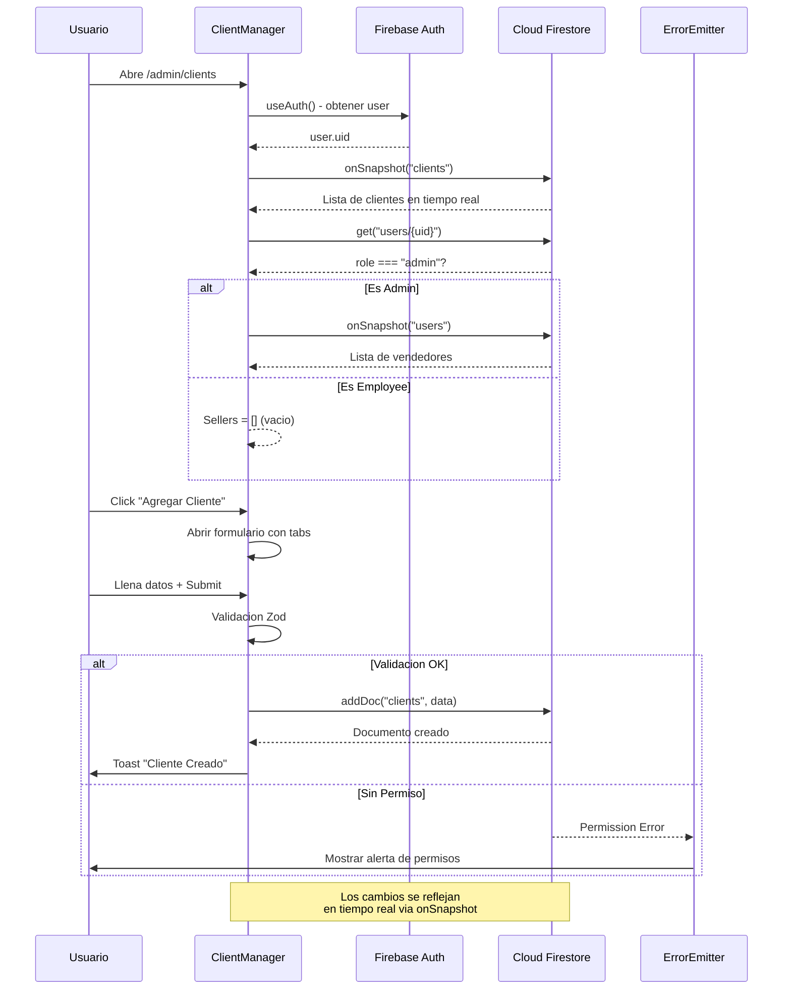

# Flujo de Datos - Modulo de Clientes

```mermaid
sequenceDiagram
    participant U as Usuario
    participant CM as ClientManager
    participant FB_AUTH as Firebase Auth
    participant FS as Cloud Firestore
    participant EE as ErrorEmitter

    U->>CM: Abre /admin/clients
    CM->>FB_AUTH: useAuth() - obtener user
    FB_AUTH-->>CM: user.uid

    CM->>FS: onSnapshot("clients")
    FS-->>CM: Lista de clientes en tiempo real

    CM->>FS: get("users/{uid}")
    FS-->>CM: role === "admin"?
    
    alt Es Admin
        CM->>FS: onSnapshot("users")
        FS-->>CM: Lista de vendedores
    else Es Employee
        CM-->>CM: Sellers = [] (vacio)
    end

    U->>CM: Click "Agregar Cliente"
    CM->>CM: Abrir formulario con tabs
    U->>CM: Llena datos + Submit

    CM->>CM: Validacion Zod
    alt Validacion OK
        CM->>FS: addDoc("clients", data)
        FS-->>CM: Documento creado
        CM->>U: Toast "Cliente Creado"
    else Sin Permiso
        FS-->>EE: Permission Error
        EE->>U: Mostrar alerta de permisos
    end

    Note over CM,FS: Los cambios se reflejan<br/>en tiempo real via onSnapshot
```
