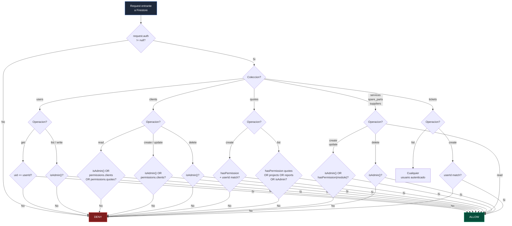

# Reglas de Seguridad Firestore - Arbol de Decision

```mermaid
flowchart TD
    REQ["Request entrante\na Firestore"] --> AUTH{"request.auth\n!= null?"}
    AUTH -->|No| DENY["DENY"]
    AUTH -->|Si| COL{"Coleccion?"}

    COL -->|users| U_OP{"Operacion?"}
    U_OP -->|get| U_GET{"uid == userId?"}
    U_GET -->|Si| ALLOW["ALLOW"]
    U_GET -->|No| DENY
    U_OP -->|list / write| U_ADMIN{"isAdmin()?"}
    U_ADMIN -->|Si| ALLOW
    U_ADMIN -->|No| DENY

    COL -->|clients| C_OP{"Operacion?"}
    C_OP -->|read| C_READ{"isAdmin() OR\npermissions.clients\nOR permissions.quotes?"}
    C_READ -->|Si| ALLOW
    C_READ -->|No| DENY
    C_OP -->|create / update| C_WRITE{"isAdmin() OR\npermissions.clients?"}
    C_WRITE -->|Si| ALLOW
    C_WRITE -->|No| DENY
    C_OP -->|delete| C_DEL{"isAdmin()?"}
    C_DEL -->|Si| ALLOW
    C_DEL -->|No| DENY

    COL -->|quotes| Q_OP{"Operacion?"}
    Q_OP -->|create| Q_CREATE{"hasPermission\n+ userId match?"}
    Q_CREATE -->|Si| ALLOW
    Q_CREATE -->|No| DENY
    Q_OP -->|list| Q_LIST{"hasPermission quotes\nOR projects OR reports\nOR isAdmin?"}
    Q_LIST -->|Si| ALLOW
    Q_LIST -->|No| DENY

    COL -->|"services\nspare_parts\nsuppliers"| PUB_OP{"Operacion?"}
    PUB_OP -->|read| ALLOW
    PUB_OP -->|"create\nupdate"| PUB_WRITE{"isAdmin() OR\nhasPermission(module)?"}
    PUB_WRITE -->|Si| ALLOW
    PUB_WRITE -->|No| DENY
    PUB_OP -->|delete| PUB_DEL{"isAdmin()?"}
    PUB_DEL -->|Si| ALLOW
    PUB_DEL -->|No| DENY

    COL -->|tickets| T_OP{"Operacion?"}
    T_OP -->|create| T_CREATE{"userId match?"}
    T_CREATE -->|Si| ALLOW
    T_CREATE -->|No| DENY
    T_OP -->|list| T_LIST["Cualquier\nusuario autenticado"]

    style ALLOW fill:#064e3b,stroke:#10b981,color:#fff
    style DENY fill:#7f1d1d,stroke:#ef4444,color:#fff
    style REQ fill:#1e293b,stroke:#3b82f6,color:#fff
```
