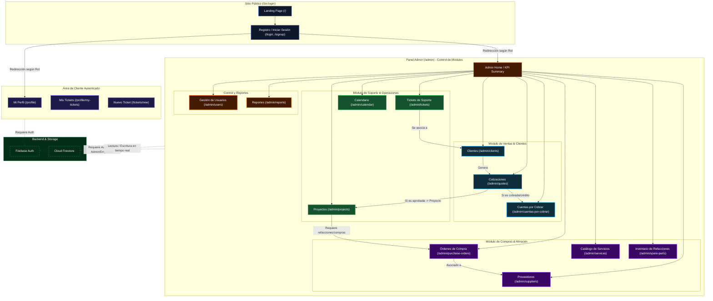

# Diagrama General de la Aplicación (Lebaref - STICS Hub)

Este diagrama describe de manera integral la estructura de navegación, los módulos funcionales y las relaciones de datos de la plataforma.

## Mapa de Componentes y Flujos de la App

## Resumen de Estructura e Interacciones

1. **Rutas Públicas**:
   - Todo visitante inicia en el sitio web corporativo o accede directamente a `/login` / `/signup`.

2. **Flujo de Clientes**:
   - Al iniciar sesión, los clientes regulares son redirigidos a su perfil y área de tickets, desde donde pueden abrir nuevos requerimientos de soporte.

3. **Panel Administrativo (Admin & Empleados)**:
   - Dividido en 4 áreas fundamentales:
     - **Ventas & Clientes**: Control de datos de clientes, cotizaciones y la gestión de saldos/créditos mediante **Cuentas por Cobrar**.
     - **Soporte & Operaciones**: Seguimiento de incidencias de clientes (Tickets), planeación de trabajos a largo plazo (Proyectos) y visualización de agenda (Calendario).
     - **Compras & Almacén**: Control de insumos/refacciones en stock, definición de servicios base y gestión de compras a proveedores.
     - **Control y Reportes**: Auditoría de personal (Permisos por módulo) y analíticas de ventas y rendimiento global.
