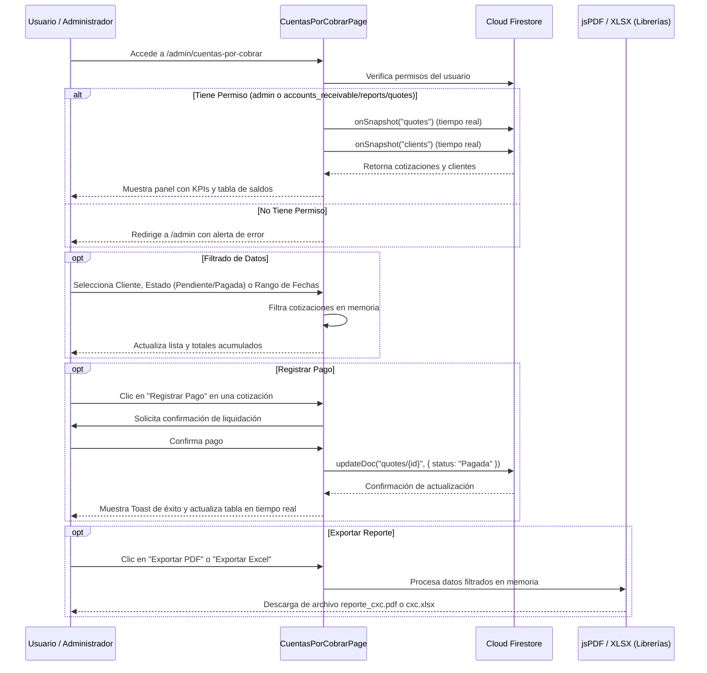

# Flujo de Trabajo - Módulo de Cuentas por Cobrar

Este módulo permite a los administradores y usuarios autorizados dar seguimiento a las cotizaciones pendientes de pago, filtrar por cliente y rango de fecha, registrar abonos/pagos y exportar reportes ejecutivos.

## Diagrama de Secuencia - Consulta y Pago

